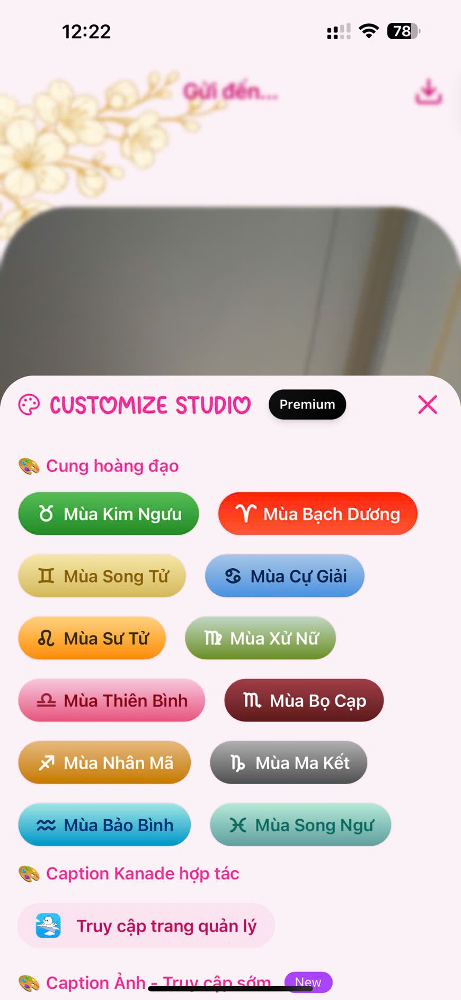
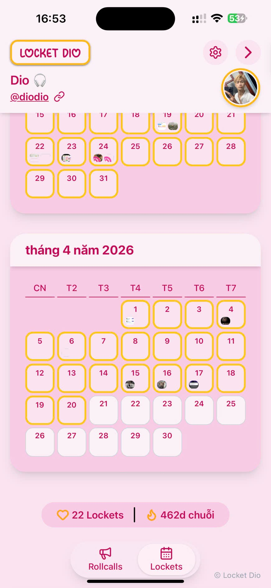
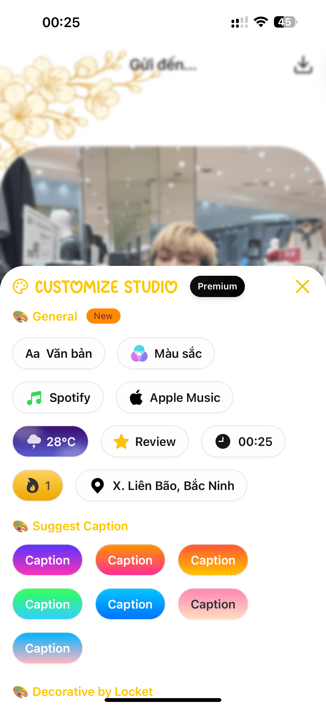

# 📸 locket-onl

<div align="center">

<p align="center">
  
</p>

**Ứng dụng web hiện đại dành cho cộng đồng Locket Widget - Chia sẻ ảnh và video ngay lập tức từ trình duyệt**

[](https://github.com/doi2523/Client-Locket-Dio/releases)
[](https://opensource.org/licenses/MIT)
[](https://locket-onl.com)
[](http://makeapullrequest.com)

[](https://reactjs.org/)
[](https://vitejs.dev/)
[](https://developer.mozilla.org/docs/Web/JavaScript)
[](https://tailwindcss.com/)

[**🌐 Demo Trực Tiếp**](https://locket-onl.com) | [**📱 Repo Frontend**](https://github.com/doi2523/Client-Locket-Dio) | [**💬 Telegram**](https://t.me/ddevdio)

</div>

---

## 📋 Mục Lục

- [✨ Tính Năng](#-tính-năng)
- [🚀 Demo](#-demo)
- [🛠️ Cài Đặt](#️-cài-đặt)
- [📁 Cấu Trúc Dự Án](#-cấu-trúc-dự-án-tham-khảo)
- [🤝 Đóng Góp](#-đóng-góp)
- [👥 Tác Giả](#-tác-giả)
- [🙏 Lời Cảm Ơn](#-lời-cảm-ơn)
- [📞 Hỗ Trợ](#-hỗ-trợ)

---

## ✨ Tính Năng

### 🔐 Xác Thực & Bảo Mật

- **🚀 Đăng Nhập Nhanh** - Hệ thống xác thực đơn giản và an toàn
- **🔒 Bảo Mật Dữ Liệu** - Không lưu trữ dữ liệu người dùng, ưu tiên quyền riêng tư
- **🛡️ Phiên Bảo Mật** - Xác thực dựa trên JWT token
- **🔐 Bảo Vệ Route** - Bảo mật cấp độ đường dẫn

### 📸 Camera & Quay Chụp

- **📷 Truy Cập Camera Trực Tiếp** - Chụp ảnh ngay trong trình duyệt
- **🎥 Quay Video HD** - Quay video chất lượng cao
- **🔄 Chuyển Đổi Camera** - Hỗ trợ camera trước/sau trên di động
- **⚡ Xem Trước Thời Gian Thực** - Live camera feed với điều khiển

### 🖼️ Quản Lý Media

- **📂 Tải File Lên** - Upload từ thư viện thiết bị
- **👁️ Xem Trước Media** - Xem trước nội dung trước khi chia sẻ
- **✂️ Cắt Thông Minh** - Cắt vuông với lựa chọn tùy chỉnh
- **📝 Caption Tùy Chỉnh** - Thêm tin nhắn cá nhân hóa
- **❤️ Tương Tác** - Hệ thống thả cảm xúc tương tác

### 🎨 Trải Nghiệm Người Dùng

- **📱 Thiết Kế Responsive** - Hoạt động trên mọi thiết bị và kích thước màn hình
- **🌙 Giao Diện Hiện Đại** - Interface sạch sẽ, trực quan
- **⚡ Hiệu Suất Nhanh** - Được tối ưu hóa với Vite bundler
- **🔮 Animation Mượt Mà** - Được hỗ trợ bởi Framer Motion
- **📊 Lịch Sử Moment** - Xem lại các khoảnh khắc đã chia sẻ

### 🔔 Tính Năng Nâng Cao

- **🔔 Thông Báo Đẩy** - Thông báo thời gian thực qua Firebase
- **💾 Hỗ Trợ Offline** - IndexedDB cho chức năng offline
- **🌐 PWA Sẵn Sàng** - Khả năng Progressive Web App
- **☁️ Lưu Trữ Đám Mây** - Tích hợp Cloudinary cho media
- **🎯 Theo Dõi Hiệu Suất** - Analytics tích hợp sẵn

---

## 🚀 Demo

<div align="center">

[](https://locket-dio.com)

</div>

### 📱 Ảnh Chụp Màn Hình

<details>
<summary><strong>🖼️ Xem Ảnh Giao Diện</strong></summary>

<div align="center">
  
  
  
  
  
</div>

</details>

---

## 🛠️ Cài đặt

Hãy tham khảo trong [Hướng dẫn](./apps/README.md)

---

## 📁 Cấu Trúc Dự Án Tham Khảo

```
Locket-Dio/
│
├── apps/                          # Chứa các ứng dụng con
│   ├── main/                      # Ứng dụng web chính
│   │   └── README.md              # Hướng dẫn chi tiết cho app main
│   │
│   ├── self-hosted/               # Phiên bản có thể tự host
│   │   ├── api/                   # Backend server
│   │   ├── web/                   # Frontend cho self-host
│   │   └── README.md              # Hướng dẫn chạy self-host
│   │
│   └── README.md                  # Mô tả chung thư mục apps
│
├── .gitignore                     # Các file bị bỏ qua khi push Git
├── LICENSE                        # Giấy phép dự án
├── README.md                      # Giới thiệu tổng quan dự án
├── package.json                   # Danh sách dependencies và scripts
├── package-lock.json              # Khóa phiên bản package
└── vercel.json                    # Cấu hình deploy Vercel
```

---

## 🤝 Đóng Góp

Chúng tôi yêu thích những đóng góp! Vui lòng đọc [Hướng Dẫn Đóng Góp](CONTRIBUTING.md) để tìm hiểu về quy trình phát triển, cách đề xuất sửa lỗi và cải tiến.

---

## 🗺️ Lộ Trình

- [ ] 🎨 **Chỉnh Sửa Hình Ảnh Nâng Cao** - Bộ lọc và hiệu ứng cho ảnh/video
- [ ] 🌙 **Hệ Thống Theme** - Chế độ Dark/Light với nhiều theme
- [ ] 🔔 **Thông Báo Nâng Cao** - Hệ thống push notification tiên tiến
- [ ] 📱 **Progressive Web App** - Triển khai PWA đầy đủ
- [ ] 🔍 **Tìm Kiếm & Khám Phá** - Tìm và khám phá moments
- [ ] 👥 **Tính Năng Xã Hội** - Bạn bè, nhóm và chia sẻ

---

## 📊 Thống Kê Dự Án

<div align="center">


</div>

---

## 👥 Tác Giả

<div align="center">

**🚀 Được tạo với ❤️ bởi**

[](https://github.com/doi2523)

**[vu thien nhan](https://github.com/doi2523)**  
_Full Stack Developer_

</div>

---

## 🙏 Lời Cảm Ơn

- 🎨 **Cảm Hứng Thiết Kế** - Xu hướng thiết kế web hiện đại và mẫu trải nghiệm người dùng
- 📚 **Cộng Đồng Open Source** - Cho những thư viện và công cụ tuyệt vời
- 🔥 **Đội Ngũ Firebase** - Vì đã cung cấp dịch vụ fontend (hosting) xuất sắc
- ☁️ **Cloudflare** - Cho giải pháp quản lý media đáng tin cậy
- 💡 **Cộng Đồng Locket Widget** - Vì cảm hứng và phản hồi
- 🌟 **Contributors** - Mọi người đã đóng góp cho dự án này

---

## 📞 Hỗ Trợ

<div align="center">

### 💬 Nhận Trợ Giúp

[](https://github.com/doi2523/Client-Locket-Dio/issues)
[](https://github.com/doi2523/Client-Locket-Dio/discussions)
[](https://t.me/ddevdio)

### ☕ Ủng Hộ Dự Án

[](https://www.buymeacoffee.com/dio2523)
[](https://paypal.me/doibncm2003)

</div>
<div align="center">
  
</div>

### 📧 Thông Tin Liên Hệ

- **Email**: doibncm2003@gmail.com
- **Website**: [https://locket-onl.com](https://locket-onl.com)
- **Telegram**: [@ddevdio](https://t.me/ddevdio)
- **GitHub**: [@doi2523](https://github.com/doi2523)

---

## ⚠️ Lưu Ý Quan Trọng

> 🔒 **Ưu Tiên Quyền Riêng Tư**: Ứng dụng này tuân theo phương pháp ưu tiên quyền riêng tư. Chúng tôi không lưu trữ dữ liệu người dùng không cần thiết.

> 🔧 **Trạng Thái Backend**: Dịch vụ backend hiện đang ở chế độ riêng tư và chứa các thành phần nội bộ chưa sẵn sàng để phát hành công khai.

> 🌟 **Phát Triển Tích Cực**: Dự án này được duy trì và cập nhật thường xuyên.

---

<div align="center">

### ⭐ Hãy Star repository này nếu bạn thấy hữu ích!

## Star History

<a href="https://www.star-history.com/?repos=doi2523%2FClient-Locket-Dio&type=date&legend=top-left">
 <picture>
   <source media="(prefers-color-scheme: dark)" srcset="https://api.star-history.com/chart?repos=doi2523/Client-Locket-Dio&type=date&theme=dark&legend=top-left" />
   <source media="(prefers-color-scheme: light)" srcset="https://api.star-history.com/chart?repos=doi2523/Client-Locket-Dio&type=date&legend=top-left" />
   
 </picture>
</a>

**Được tạo với ❤️ bởi [Dio](https://github.com/doi2523) | © 2025 [Locket Dio](https://locket-dio.com) | Tất cả quyền được bảo lưu**

[](#-locket-dio)

</div>
